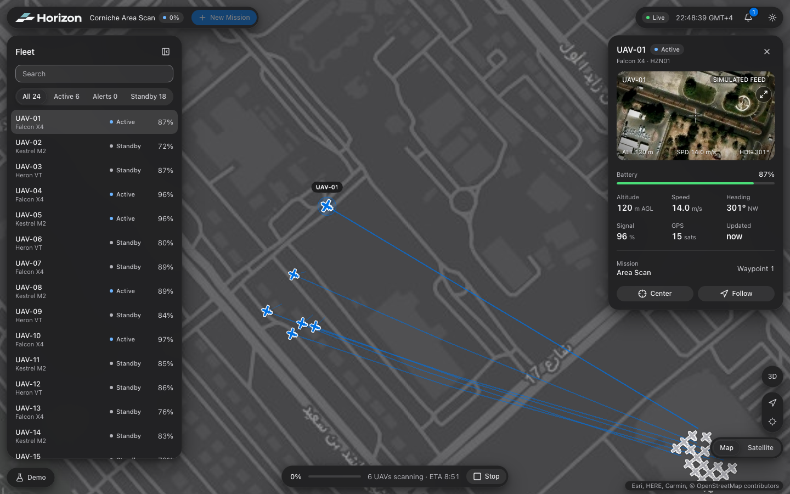
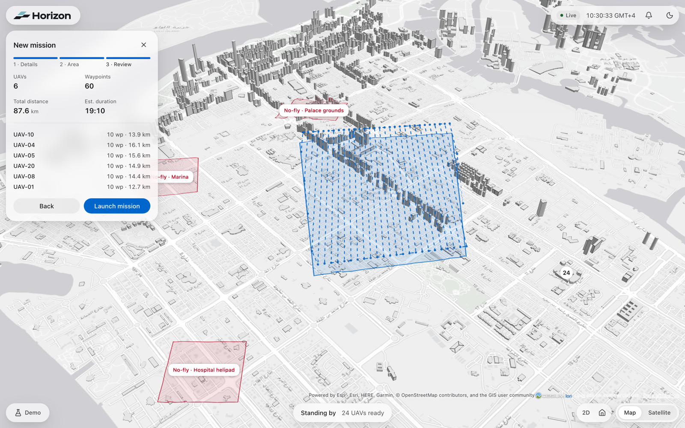
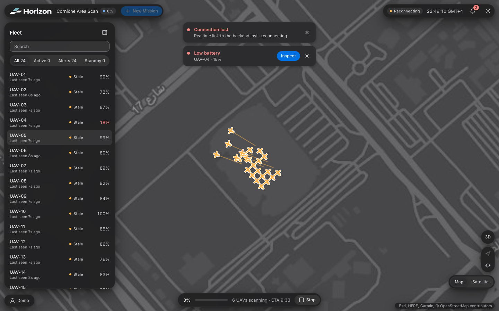

<h1 align="center">
  <picture>
    <source media="(prefers-color-scheme: dark)" srcset="apps/control-center/src/shared/brand/horizon-logo-dark.svg" />
    
  </picture>
</h1>

<p align="center">
  <a href="https://github.com/romaxlab/horizon/actions/workflows/ci.yml"></a>
</p>

Horizon is a browser-based 3D mission-control interface for planning and monitoring autonomous UAV operations.

The product combines mission planning, realtime fleet telemetry, 3D situational awareness, UAV inspection, simulated video and incident handling in a single operator workspace.

The initial implementation uses deterministic simulated data. Application boundaries are designed so REST, WebSocket and media providers can be introduced without rewriting feature UI.



## Quick start

Requirements: Node.js 22+ and pnpm via Corepack (`corepack enable`).

```bash
pnpm install
pnpm dev                      # http://localhost:5173/control-center
```

Everything runs against a deterministic in-browser simulator; no backend or keys are needed.
Use **Demo** (bottom left) to run scenarios: Normal, Incident (scripted failures) or Stress
(480 UAVs), inject failures and speed up time.

| Command | |
| --- | --- |
| `pnpm dev` | Control Center dev server |
| `pnpm check` | lint + typecheck + unit tests + build |
| `pnpm test` | unit/integration tests (Vitest) |
| `pnpm e2e` / `pnpm e2e:ui` | Playwright workflows (mission, inspection, recovery) |
| `pnpm build` | production build |

Optional configuration (`apps/control-center/.env.local`, see `.env.example`):

| Variable | Default | |
| --- | --- | --- |
| `VITE_DATA_SOURCE` | `mock` | `remote` uses a REST + WebSocket backend |
| `VITE_API_URL` / `VITE_WS_URL` | — | backend endpoints (required for `remote`) |
| `VITE_DEMO_CONTROLS` | on in dev | show the Demo panel (mock only) |
| `VITE_DEMO_AUTOSTART` | `false` | start the demo Area Scan on load |
| `VITE_SIMULATOR_MODE` | `deterministic` | or `random` |
| `VITE_TELEMETRY_FLUSH_MS` | `100` | telemetry → state flush interval |
| `VITE_CESIUM_ION_TOKEN` | — | 3D buildings (Google Photorealistic / OSM) in 3D view |

## Core workflow

```text
Open Control Center
→ Create Area Scan mission
→ Define mission area
→ Generate UAV-specific routes
→ Launch mission
→ Monitor realtime execution
→ Inspect UAV telemetry and video
→ Handle an operational incident
→ Recover connection and state
```

## Technology

- Vue 3
- TypeScript
- Vite
- pnpm workspaces
- Vue Router
- Pinia
- TanStack Vue Query
- TailwindCSS
- CesiumJS
- Zod
- Vitest
- Vue Test Utils
- Playwright

HTTP requests use native `fetch` behind a small repository/HTTP boundary. Realtime telemetry uses a transport abstraction so simulated and remote implementations share the same application pipeline.

## Repository structure

```text
horizon/
├── apps/
│   └── control-center/
├── packages/
│   ├── domain/
│   ├── realtime/
│   ├── simulator/
│   └── ui/
├── docs/
│   ├── ARCHITECTURE.md
│   ├── DESIGN-SYSTEM.md
│   └── ROADMAP.md
├── AGENTS.md
├── README.md
├── pnpm-workspace.yaml
└── package.json
```

The workspace is intentionally small. New packages or architectural layers should be introduced only when they protect a real boundary or provide real reuse.

## Product scope

The MVP centers on one operational route:

```text
/control-center
```

The 3D map remains the primary workspace. Mission planning, UAV inspection and incident handling are contextual modes and overlays rather than separate CRUD-style pages.

Primary mission type:

```text
Area Scan
```

The operator defines a polygon, altitude and UAV count. The planner generates deterministic UAV-specific routes that can be reviewed and launched.

Standard demo dataset:

- 24 UAVs in the fleet;
- 6 UAVs assigned to an active mission;
- realtime simulated telemetry;
- deterministic incidents;
- simulated UAV video feeds.

## Screenshots

| Mission planning (light) | Incidents and recovery (dark) |
| --- | --- |
|  |  |

## Documentation

- `AGENTS.md` — repository implementation rules and quality expectations
- `docs/ARCHITECTURE.md` — product structure, data ownership and infrastructure boundaries
- `docs/DESIGN-SYSTEM.md` — Tailwind, tokens, themes and UI primitive rules
- `docs/ROADMAP.md` — implementation milestones

## Status

MVP complete: the full workflow (plan → launch → monitor → inspect → incident → recover) runs
end-to-end against the simulator, with Playwright coverage of the primary flows. Remote REST,
WebSocket and video implementations can be added behind the existing contracts
(`FleetRepository`, `RealtimeTransport`, `MissionPlanner`, `VideoProvider`).

## Disclaimer

Horizon is a software prototype. It does not provide real aircraft control, safety-critical flight planning or production autonomy functionality.
