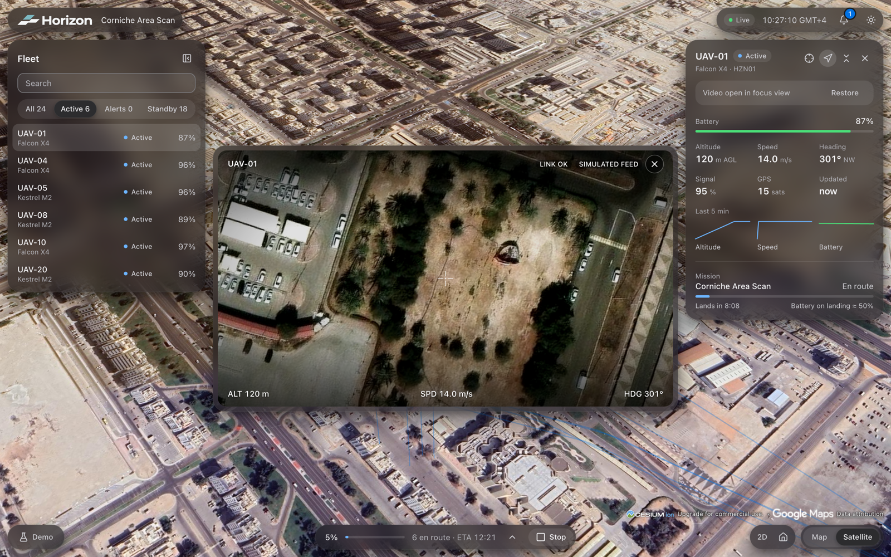

<h1 align="center">
  <picture>
    <source media="(prefers-color-scheme: dark)" srcset="apps/control-center/src/shared/brand/horizon-logo-dark.svg" />
    
  </picture>
</h1>

<p align="center">
  <strong>3D mission control for autonomous UAV fleets</strong>
</p>

<p align="center">
  <a href="https://github.com/romaxlab/horizon/actions/workflows/ci.yml"></a>
</p>

<p align="center">
  Plan missions, follow realtime telemetry on a 3D map, inspect UAVs with simulated video and
  handle incidents — in a single operator workspace. Runs end-to-end against a deterministic
  in-browser simulator; REST and WebSocket backends plug in through the same contracts.
</p>

<p align="center">
  
</p>

<p align="center">
  <a href="#quick-start">Quick start</a> ·
  <a href="#configuration">Configuration</a> ·
  <a href="#product-scope">Product scope</a> ·
  <a href="#architecture">Architecture</a> ·
  <a href="#screenshots">Screenshots</a> ·
  <a href="#documentation">Documentation</a>
</p>

---

## Quick start

Requires Node.js 22+ and pnpm via Corepack (`corepack enable`).

```bash
pnpm install
pnpm dev          # http://localhost:5173/control-center
```

No backend or keys are needed: everything runs against the in-browser simulator. Open **Demo**
(bottom left) to run a scenario — **Normal**, **Incident** (scripted failures) or **Stress**
(480 UAVs) — inject failures, simulate a network outage and speed up time.

| Command | What it does |
| --- | --- |
| `pnpm dev` | Control Center dev server |
| `pnpm check` | Quality gate: lint, typecheck, unit tests, build |
| `pnpm test` | Unit and integration tests (Vitest) |
| `pnpm e2e` · `pnpm e2e:ui` | Playwright workflows: missions, inspection, follow, recovery |
| `pnpm build` | Production build |
| `pnpm build:uav-model` | Regenerate the 3D UAV model from the marker artwork |

## Configuration

Optional. Put overrides in `apps/control-center/.env.local` (git-ignored); every variable is
documented in `apps/control-center/.env.example` and validated at startup.

| Variable | Default | Purpose |
| --- | --- | --- |
| `VITE_DATA_SOURCE` | `mock` | `mock` runs the simulator; `remote` uses a REST + WebSocket backend |
| `VITE_API_URL` · `VITE_WS_URL` | — | Backend endpoints, required for `remote` |
| `VITE_DEMO_CONTROLS` | on in dev | Show the Demo panel (mock only) |
| `VITE_DEMO_AUTOSTART` | `false` | Start the demo Area Scan on load |
| `VITE_SIMULATOR_MODE` | `deterministic` | Or `random` |
| `VITE_TELEMETRY_FLUSH_MS` | `100` | Telemetry → state flush interval (16–1000 ms) |
| `VITE_CINEMATIC_INTRO` | `true` | Cinematic startup sequence; `false` opens the Control Center directly |
| `VITE_CESIUM_ION_TOKEN` | — | Cesium World Terrain, ion satellite imagery and 3D buildings in the 3D view |

Without an ion token the map is fully keyless (Esri basemaps). The token ships in the client
bundle, so use one restricted to the app's URLs.

## Product scope

One operational route, `/control-center`. The 3D map is the primary workspace; mission planning,
UAV inspection and incident handling are contextual panels and overlays, not separate pages.

```text
Create a mission → draw it on the map → review generated routes → launch
→ monitor execution → inspect a UAV (telemetry, video) → handle an incident → recover
```

| Mission type | Operator input | Result |
| --- | --- | --- |
| Area Scan | Polygon | One scan strip per UAV |
| Patrol | Closed loop, number of laps | UAVs evenly spaced along the loop |
| Point Inspection | Target, radius, number of orbits | UAVs orbit the target |

The operator sets altitude and UAV count. The planner generates deterministic, UAV-specific routes
that detour around fixed no-fly zones on transit, scan lines and the way home. During execution
the status bar shows phase counts and per-UAV details: phase, lap, ETA and battery on landing.

The demo dataset is a fleet of 24 UAVs (6 assigned to the prepared mission) with realtime
simulated telemetry, deterministic incidents and simulated video feeds.

## Architecture

```text
horizon/
├── apps/
│   └── control-center/   Vue application: feature modules, composition, Cesium map
├── packages/
│   ├── domain/           Shared domain types and geometry
│   ├── realtime/         Realtime transports and the latest-state buffer
│   ├── simulator/        Deterministic fake backend: fleet, missions, routing, incidents
│   └── ui/               Design-system tokens and primitives
└── docs/
```

- **One pipeline for mock and remote.** `FleetRepository`, `RealtimeTransport`, `MissionPlanner`,
  `AirspaceRepository` and `VideoProvider` each have a simulator and a REST/WebSocket
  implementation, selected once at bootstrap with `VITE_DATA_SOURCE`. The remote build never
  loads the simulator.
- **Realtime.** Transport → validation → latest-state buffer → batched flush → Pinia → Vue and
  Cesium; rendering cadence is decoupled from the message rate.
- **Boundaries.** External payloads enter as `unknown`, are validated with Zod and mapped to
  domain models before they reach the UI. HTTP uses native `fetch` behind a small repository layer.

The workspace is intentionally small: new packages or layers are added only for a real boundary
or real reuse.

**Stack:** Vue 3 · TypeScript (strict) · Vite · pnpm workspaces · Vue Router · Pinia ·
TanStack Vue Query · Tailwind CSS · CesiumJS · Zod · Vitest · Playwright

## Screenshots

| Mission planning (light, 3D) | UAV inspection and video |
| :---: | :---: |
|  |  |

| Incidents and recovery (dark, 3D) |
| :---: |
|  |

## Documentation

| Document | Contents |
| --- | --- |
| [`docs/ARCHITECTURE.md`](docs/ARCHITECTURE.md) | Product structure, data ownership, infrastructure boundaries, wire format |
| [`docs/DESIGN-SYSTEM.md`](docs/DESIGN-SYSTEM.md) | Tailwind, tokens, themes and UI primitive rules |
| [`docs/ROADMAP.md`](docs/ROADMAP.md) | Implementation milestones |

## Status

The MVP is complete. The full workflow — plan, launch, monitor, inspect, incident, recover — runs
end-to-end against the simulator, with Playwright coverage of the primary flows. Remote
REST/WebSocket implementations of every contract are in place; the wire format is documented in
[`docs/ARCHITECTURE.md`](docs/ARCHITECTURE.md) §13.

## Disclaimer

Horizon is a software prototype. It does not provide real aircraft control, safety-critical flight
planning or production autonomy functionality.
